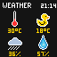
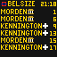
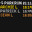

# Pixoo64

<table border="0" width="100%">
  <tr>
    <td width="33.3%" align="center">
      
    </td>
    <td width="33.3%" align="center">
      
    </td>
    <td width="33.3%" align="center">
      
    </td>
  </tr>
</table>
# Setup

### Shopping

Buy a Pixoo64 from the Divoom website.

If you use my invite link, https://divoominternationa.refr.cc/default/u/peterbatchelor?s=sp&t=cp, then you'll get 12% off.

### Pixoo64 API
Once you've bought a Pixoo64,
you'll want to send images to it.

Traditionally this is done through the Divoom app,
but we're going to be using their API.

The Pixoo64 has 2 APIs, 
a local API and a cloud API, 
but the cloud API is buggy and undocumented,
so we'll use the local API.

The local API can only receive messages from devices on our local network.
To avoid running a device like a Raspberry Pi 24/7,
we'll set up port forwarding on our router,
so that we can call the API from the cloud.

1) Ask your favourite LLM how to set up port forwarding.
2) Export the pixoo url with `export PIXOO_URL=http://<PUBLIC_IP>:<PIXOO_PORT>/post`.

Once `PIXOO_URL` is set, 
sending images is easy.
```python
import time

from pixoo import Pixoo
from PIL import Image


pixoo = Pixoo()
image = Image.open("<IMAGE_PATH>")
payload = {
    "Command": "Draw/SendHttpGif",
    "PicNum": 1,
    "PicWidth": 64,
    "PicOffset": 0,
    "PicID": int(time.time()),
    "PicSpeed": 0,
    "PicData": pixoo.encode_image(image),
}
pixoo.post(payload)
```

In the subsequent sections,
we'll tackle how to turn various data endpoints into dashboards.

### TFL API

We are going to make a departure dashboard (tube/overground) using the TFL API.

The API can be used without an API key, 
but the responses are more reliable with one.

1) Request an API key from the TFL website (https://api-portal.tfl.gov.uk/signup). 
2) Export the key with `export TFL_APP_KEY=<TFL_APP_KEY>`.
3) Add a TFL message to `local/my_config.py`. I.e.
```python
from config import TflMessage
from tfl import Stations

belsize_message = TflMessage(
    station_id=Stations.BELSIZE_PARK.station_id, 
    inbound=True
)
```
4) Test that the key is working by running `cd local && python tfl.py`. 
This will make a sample image called `tfl.png`.


If you want more stations,
or particular icons,
then post in the Issues tab.

### Parkrun API

We are going to make a Parkrun leaderboard. 
It will show the most recent Parkrun times in speed order,
with the top 3 in gold, silver and bronze.

1) Add a parkrun message to `local/my_config.py`. I.e.
```python
from config import ParkrunMessage

parkrun_message = ParkrunMessage(
    id_to_name={
        "1143476": "Archie L",
        "6307326": "Patrick L",
        "2342561": "Sean L",
    }
)
```
2) Test that your config is working by running `cd local && python parkrun.py`.
This will make a sample image called `parkrun.png`.


When running in the cloud,
the Parkrun website will block the IP range of the AWS Lambdas,
so you'll need to set a proxy (`export PROXY_URL=<PROXY_URL>`).
I got a free one at https://dashboard.webshare.io.

### Weather API

We are going to make a weather dashboard using the Met Office API (and a random Hampstead Heath pond website).

It will display the temperature,
the pond temperature,
the probability of rain,
and the humidity.

The API actually returns a lot more data than this,
but these measurements are the most useful to me.

1) Request an API key from the Met Office website (https://datahub.metoffice.gov.uk/), you'll need the site-specific forecast.
2) Export the key with `export MET_OFFICE_API_KEY=<MET_OFFICE_API_KEY>`.
3) Add a weather message to `local/my_config.py`. I.e.
```python
from config import WeatherMessage

weather_message = WeatherMessage(
    lat="10.0000", 
    lon="-10.0000",
)
```

3) Test that the key is working by running `cd local && python weather.py`. 
This will make a sample image called `weather.png`.


### Messages

Once you've set all your messages in `my_config.py`,
then concatenate them into a config. 

I.e. The config below will create 4 messages per minute
```python
from config import Config

config = Config(
    messages=[
        belsize_message, 
        heath_message, 
        weather_message, 
        parkrun_message,
    ],
    messages_per_minute=4,
)
```

Once this is done, 
you're ready for deployment.

### Infrastructure

If you don't want to host your own infrastructure,
message me with your `my_config.py` file,
and I can host everything for you.

For those who want to host their own infrastructure,
we'll be using AWS, which consists of:
* A CloudWatch rule
* Serverless functions (AWS Lambda)
* A queue (AWS SQS)
* A cache (AWS S3)

Once per minute, 
a CloudWatch rule will trigger the producer Lambda,
which will then send jobs to the SQS queue (with set delays).

I.e. It might send 4 jobs, with delays 0, 15, 30 and 45 seconds.

When a job joins the SQS queue,
the consumer Lambda will fire,
read the job description,
design a frame,
and send it to the Pixoo64.

Each Lambda function only runs for ~300ms,
so the cost is ~20p per month.

Using a persistent server to send requests, 
like a `t4g.nano`,
would cost ~£5 per month.

1) Install the AWS CLI (https://docs.aws.amazon.com/cli/latest/userguide/getting-started-install.html)
2) Install npm (https://nodejs.org)
3) Install Docker (https://www.docker.com/products/docker-desktop/)
4) Install AWS CDK with `npm install -g aws-cdk`
5) Start Docker (you'll need this to build the environment for the AWS Lambda)
6) Go into the AWS folder with `cd aws`
7) Run `aws configure` to set your credentials
8) If it's your first time using AWS CDK, run `cdk bootstrap` to create the CDK toolkit stack.
9) Run `cdk diff` to see what infrastructure will be built.
10) Build your infrastructure with `cdk deploy`.

# Questions

If you need any help setting up this project, please post in the Issues tab.

